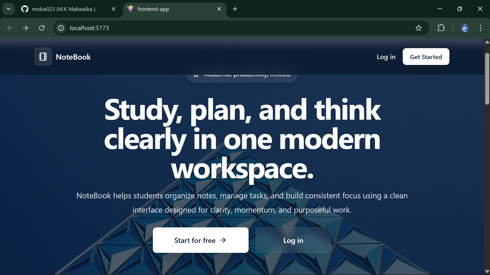
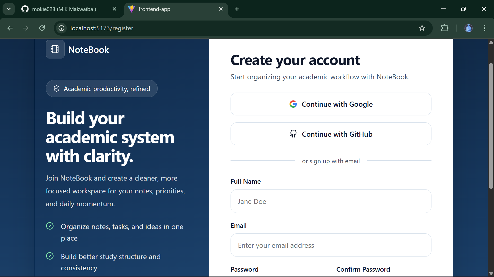
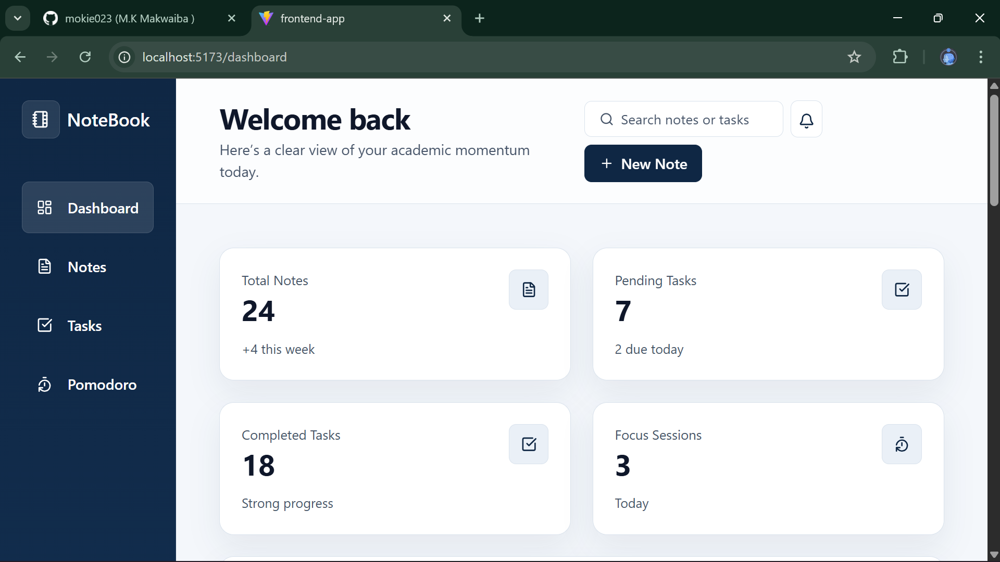

# Notebook Productivity API

A modern **productivity backend API** built with Laravel that powers a notebook-style system for managing:

- Notes
- Categories
- Tags
- Journals
- Tasks
- Pomodoro sessions
- Dashboard insights

The API follows a **RESTful architecture** and uses **token-based authentication with Laravel Sanctum**.  
It is designed to serve **decoupled frontend applications** such as React or Vue.

---

# Overview

Notebook API provides a backend system that helps users organize and manage productivity workflows.

The API allows users to:

- capture and organize notes
- manage tasks and journals
- categorize and tag information
- run Pomodoro productivity sessions
- view dashboard summaries

The system is designed as a **decoupled backend**, meaning it can easily integrate with modern frontend frameworks.

---

# Key Features

- Token-based authentication using Laravel Sanctum
- Secure user authentication system
- RESTful API architecture
- Structured JSON responses
- CRUD operations for productivity resources
- Dashboard analytics
- Modular Laravel architecture
- Designed for frontend integration (React / Vue)

---

# Tech Stack

| Layer | Technology |
|------|------------|
| Backend | Laravel |
| Authentication | Laravel Sanctum |
| Database | MySQL / PostgreSQL |
| API Architecture | REST |
| Development Tools | Composer, Postman |
| Version Control | Git + GitHub |

---

# System Architecture

The backend follows a **modular controller-based architecture**.

```
Controllers
    ↓
Services / Business Logic
    ↓
Models (Eloquent ORM)
    ↓
Database
```

The API serves frontend applications through structured JSON responses.

---

# Base API URL

```
http://127.0.0.1:8000/api/v1
```

---

# Authentication Flow

The API uses **Laravel Sanctum token authentication**.

Authentication process:

```
Register → Login → Receive Token → Access Protected Routes
```

All protected routes require the header:

```
Authorization: Bearer YOUR_TOKEN
```

---

# Authentication Endpoints

## Register

Create a new user account.

**POST**

```
/api/v1/auth/register
```

### Request Body

```json
{
  "name": "Moeketsi",
  "email": "moeketsi@example.com",
  "password": "password123",
  "password_confirmation": "password123"
}
```

### Example Response

```json
{
  "success": true,
  "message": "User registered successfully",
  "data": {
    "user": {
      "id": 1,
      "name": "Moeketsi",
      "email": "moeketsi@example.com"
    },
    "token": "1|example_token_here"
  }
}
```

Expected Result:

- User account created
- Authentication token returned

---

## Login

Authenticate a user.

**POST**

```
/api/v1/auth/login
```

### Request Body

```json
{
  "email": "moeketsi@example.com",
  "password": "password123"
}
```

### Example Response

```json
{
  "success": true,
  "message": "Login successful",
  "data": {
    "user": {
      "id": 1,
      "name": "Moeketsi",
      "email": "moeketsi@example.com"
    },
    "token": "2|example_token_here"
  }
}
```

Expected Result:

- Login successful
- Token returned

---

## Get Authenticated User

Retrieve the current authenticated user's profile.

**GET**

```
/api/v1/auth/me
```

### Headers

```
Authorization: Bearer YOUR_TOKEN
Accept: application/json
```

### Example Response

```json
{
  "success": true,
  "message": "Profile retrieved",
  "data": {
    "id": 1,
    "name": "Moeketsi",
    "email": "moeketsi@example.com"
  }
}
```

---

## Logout

Invalidate the current authentication token.

**POST**

```
/api/v1/auth/logout
```

### Headers

```
Authorization: Bearer YOUR_TOKEN
Accept: application/json
```

### Example Response

```json
{
  "success": true,
  "message": "Logged out successfully",
  "data": null
}
```

Expected Result:

- User logged out
- Token becomes invalid

---

# Notes Endpoints

## Create Note

Create a new note.

**POST**

```
/api/v1/notes
```

### Headers

```
Authorization: Bearer YOUR_TOKEN
Accept: application/json
Content-Type: application/json
```

### Request Body

```json
{
  "title": "My first note",
  "content": "This is my first note content.",
  "note_category_id": 1,
  "tags": [1, 2]
}
```

Expected Result:

- Note successfully created
- Linked with category and tags

---

# API Modules

The API currently includes the following modules:

```
Auth
Notes
Categories
Tags
Journals
Tasks
Pomodoro
Dashboard
```

Each module follows a consistent **RESTful CRUD structure**.

---

# Testing the API

You can test the API using:

- Postman
- Insomnia
- Thunder Client

### Recommended Test Flow

1. Register user
2. Login user
3. Copy token
4. Test protected endpoints

Example header:

```
Authorization: Bearer YOUR_TOKEN
```

---

# Running the Project

## Install Dependencies

```
composer install
```

## Configure Environment

Copy `.env.example`

```
cp .env.example .env
```

Generate application key:

```
php artisan key:generate
```

---

## Run Migrations

```
php artisan migrate
```

---

## Start Development Server

```
php artisan serve
```

The API will run at:

```
http://127.0.0.1:8000
```

---

# Project Goals

The goal of this project is to build a **modern productivity backend system** that can power applications similar to:

- Notion
- Obsidian
- Evernote

but focused on **structured productivity workflows**.

---

# Future Improvements

Planned enhancements:

- Full text search
- AI-powered note summarization
- Advanced dashboard analytics
- Collaboration features
- Real-time updates
- Notifications


# Application Screenshots

## Home Page
<p align="center">
  
</p>

## Login Page
<p align="center">
  
</p>

## Dashboard
<p align="center">
  
</p>
---

# License

This project is open-source and available under the **MIT License**.